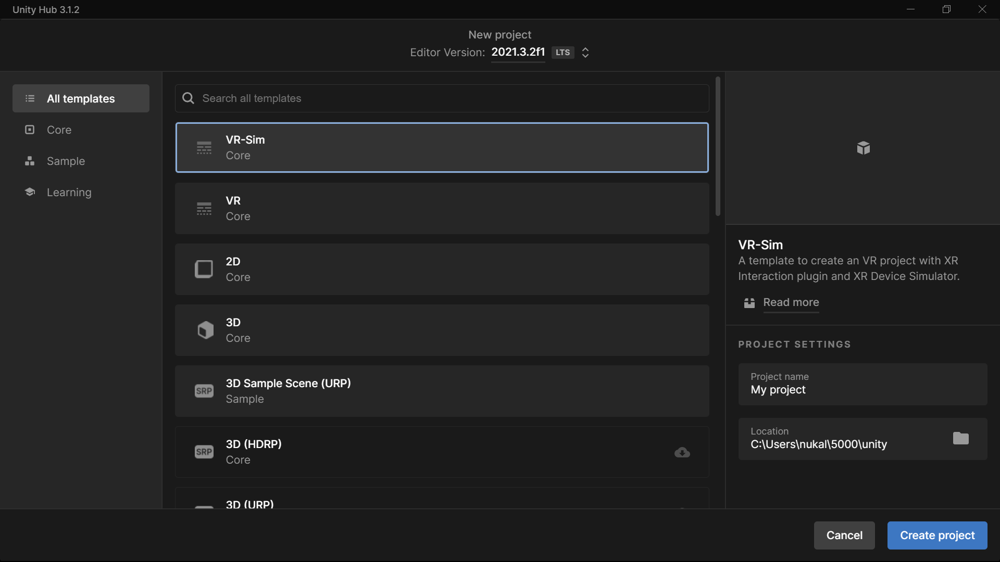
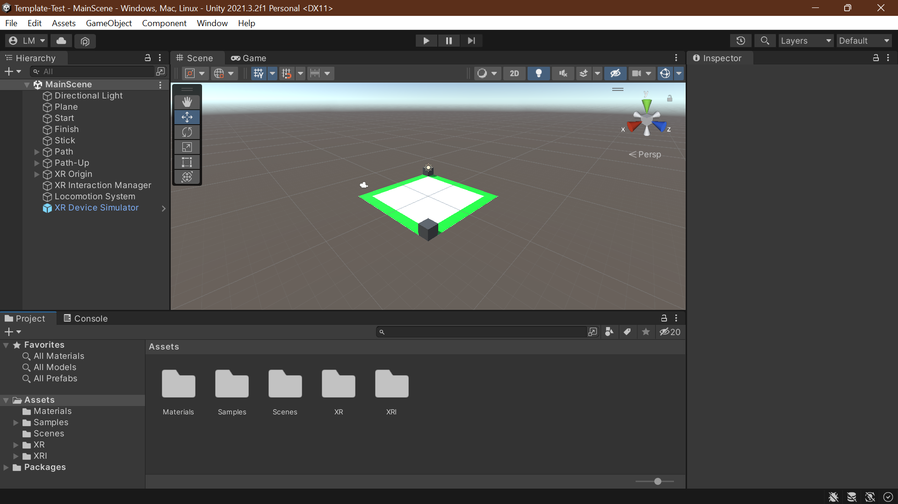

# Unity VR Sim Template

A template to create an VR project with XR Interaction plugin and XR Device Simulator.

## Requirements

1. **Unity Version**: 2020LTS (Min)

## How To Use This Template

1. Locate Unity's Template Folder
   ### On a Mac
   > /Applications/Unity/Hub/Editor/<VERSION>/Unity.app/Contents/Resources/PackageManager/ProjectTemplates
   ### On a Windows
   > \Program Files\Unity\Hub\Editor\<VERSION>\Editor\Data\Resources\PackageManager\ProjectTemplates
2. Download the `tgz` file [the ProjectData~ dir is the source code]
3. Copy `tgz` file to `Unity's template folder`
4. Cold Restart Unity Hub
5. You should see a template as follows
   
6. On completion of initialization you should see the following sample scene
   
